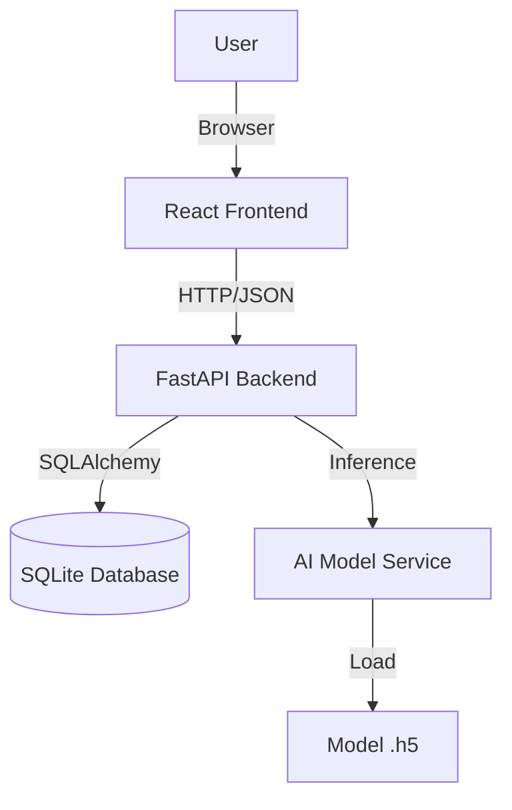
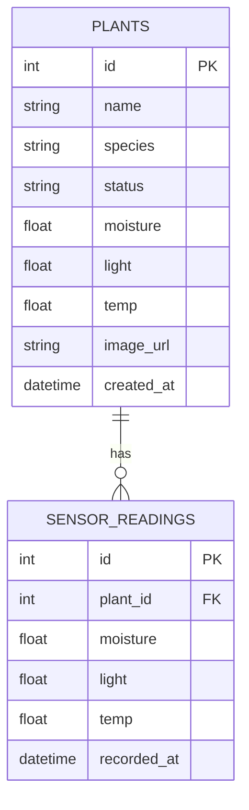
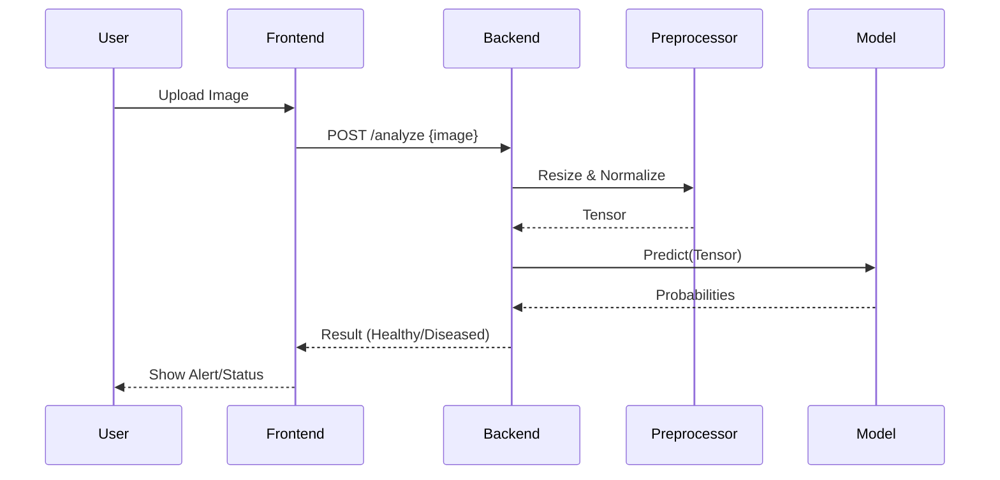

# System Architecture

## Architecture Diagram (Placeholder for system_architecture.png)

## Database Schema (Placeholder for database_schema.png)

## Model Flow (Placeholder for model_flow_diagram.png)

